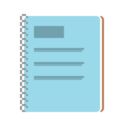

 </a>

<h1 align="center">Gaston</h1>

---

 
      

# 📝 Table of Contents

- [About](#🧐-about)
- [Installing](#⬇️installing) 
- [Usage](#🎈-usage-a-nameusagea)
- [Built Using](#⛏️-built-using-a-name--builtusinga)
- [Authors](#✍️-authors-a-name--authorsa)

# 🧐 About

Gaston è un gestionale elegante che permette di aggiungeree e rimuovere utenti ad una rubrica e successivamente modificarla e visualizzarla

 

## ⬇️Installing

 

Clone the git hub repository

Download the zip of the project

Extract the zip and open the project file

edit or compile and run the file

 

# 🎈 Usage 

## Prerequisites

 

To use the library file you need the [MSVC](https://docs.microsoft.com/it-it/cpp/build/reference/compiler-options?view=msvc-170) compiler or onother compiler for C++.

 

# ⛏️ Built Using 

- C++ - Linguaggio di Programmazione
- TDMGCC - Compilatore C++

# ✍️ Authors 

- [@pietrogervasoni](https://github.com/pietrogervasoni) - Readme, Icon & Initial work
- [@reallukee](https://github.com/reallukee) - Idea & Initial work